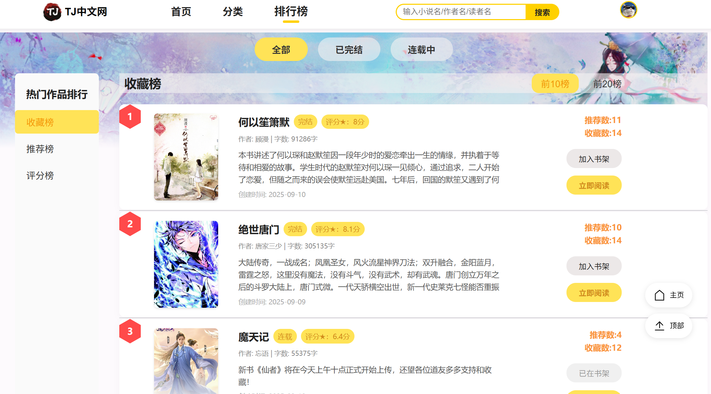

# TJ小说网

2025年同济大学数据库课程设计暑期项目|A full-stack novel platform with Oracle DB, C# backend, and Vue.js frontend

> Copyright © 2025 OurNovel Team - Licensed under [MIT License](LICENSE)
>
> 版权所有 © 2025 OurNovel  | OurNovel 项目开发组 - 采用 [MIT 许可证](LICENSE)授权


<!-- 技术栈徽章 -->


## 项目名称

TJ小说网

## 项目网址

[🚀 TJ小说网,开始你的小说之旅！](http://115.29.190.190:80/)

## 项目简介

TJ Novels — The integrated hub for creation, management, and reading.

TJ小说网: 集创作、管理与阅读于一体的综合家园。


> ***Relevant course***  
>
> * Database Course Project 2025 (同济大学数据库课程设计 2025)


## 项目运行

### 启动前端

```bash
$ cd Frontend
$ npm install
$ npm run serve
```

### 启动后端

确认电脑上有安装.NET SDK 8.0.412，若未安装，请到网站https-//dotnet.microsoft.com/zh-cn/download/dotnet/8.0 下载

```bash
$ cd Backend
$ dotnet run
```


## 项目界面

### 1.登录注册页面


### 2.读者端

#### ①首页


#### ②分类页


#### ③排行页



#### ④个人主页


#### ⑤充值页


#### ⑥展示页


#### ⑦书籍详情页


### 3.作者端


### 4.管理员端


